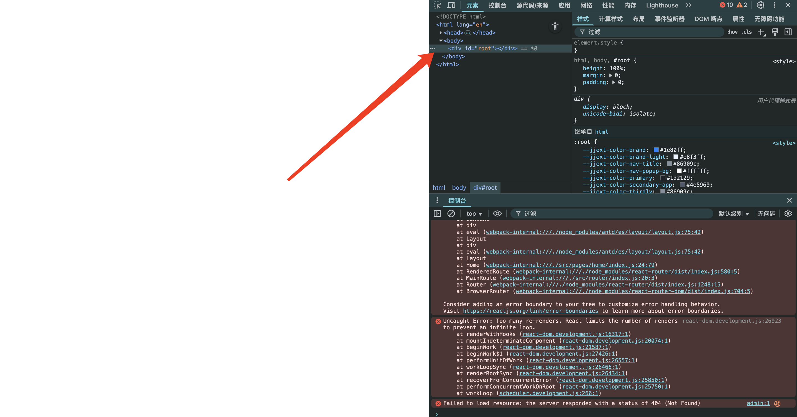

# 从零搭建 react 模板 【React 18 + Webpack 5 + Antd 5 + React-Router 6 】

环境 node v18 +
## 前言

之前做项目都是用的现成的 umi 、 antd-pro 、create-react-app 等现成的 react 框架或脚手架，这次重新找工作打算沉淀一下 webpack 技术，前 2 天心血来潮打算构建一份可用的 react 基础脚手架，从webpack 初始化搞起，到配置 Babel、配置 Plugin，再到配置 react-router，用的基本都是目前主流的，也方便随时回头看，每一步在 README.md 都有对应的解析

## 项目目录

```
│  .babelrc
│  .gitignore
│  LICENSE
│  package.json
│  postcss.config.js
│  README.md
├─build
│  ├─webpack.base.js
│  ├─webpack.dev.js
│  └─webpack.prod.js
├─dist
├─mock
│  └─index.json
├─public
│  └─index.html
├─readmeimgs (仅供 readme 图片存储用)
└─src
    │  index.js
    │  global.less
    ├─components
    ├─pages
    ├─router
    ├─static
    ├─store
    └─utils
        utils.js
```


## 初始化项目

yarn init


## 配置webpack

### 安装 webpack 5

```json
yarn add webpack webpack-cli webpack-dev-server webpack-merge -D
```

### 出入口配置

```js
{
    entry: path.resolve(__dirname, "../src/*.js"),
    output: {
        filename: "[name].[hash:8].js",
        path: path.resolve(__dirname, "../dist"), // 打包后的目录
    },
}

```

### 配置 resolve模块解析

#### extensions

指定模块引入时不需要的扩展名，例如 .js、.jsx 等，这样在引入组件时可以省略

#### alias

配置模块的别名，可以简化模块的引用路径

```js
    resolve: {
        extensions: [".js", ".jsx", ".less", ".css"],
        alias: {
            "@": path.resolve(__dirname, "../src"),
        },
    },
```

例如：import Index from "../src/home/index.js|jsx"，可以写成 import Index from "@/home/index"，省略后缀名,简化路径

#### modules

配置解析模块时应该搜索的目录，默认是 ['node_modules']

```js
module.exports = {
  resolve: {
    modules: [path.resolve(__dirname, 'src'), 'node_modules'],
  },
};
```

#### mainFiles

配置在目录中优先解析的文件，默认是 ['index']

```js
module.exports = {
  resolve: {
    mainFiles: ['main', 'index'],
  },
};
```

#### mainFields

配置在寻找包时应该查找的字段，例如 ['browser', 'module', 'main']

```js
module.exports = {
  resolve: {
    mainFields: ['browser', 'module', ]
  },
};
```

### 配置loader(Less样式、图片等资源、js)

```json
yarn add less less-loader style-loader css-loader url-loader mini-css-extract-plugin postcss-loader autoprefixer -D
```

#### 处理js|jsx

```js
    rules:[
        {
            test: /\.(js|jsx)$/,
            include: path.join(__dirname, "../src"),
            use: [
                {
                    loader: "babel-loader",
                    options: {
                        cacheDirectory: true,
                    },
                },
            ],
        }
    ]

```

#### 处理less

```json
yarn add less less-loader style-loader css-loader postcss-loader autoprefixer -D
```

style-loader：将样式注入到html的 style 标签

css-loader：解析css文件，将CSS转化为CommonJS

postcss-loader：处理css中的css前缀，新版配置在postcss.config.js中，webpack 里仅保留名称即可

autoprefixer：自动添加css前缀，配置在postcss.config.js中

less-loader：将less编译成css

```js
    rules:[
        {
            test: /\.less$/,
            use: [
                "style-loader",
                "css-loader",
                "postcss-loader",
                "less-loader",
            ]
        },
        {
            test: /\.css$/,
            use: [
                "style-loader",
                "css-loader",
                "postcss-loader"
            ]
        },
    ]

```

#### 处理图片、视频、字体、文件等资源

webpack 5内置了 asset 资源处理功能，可以自动处理图片、视频、字体、文件等资源，无需额外配置模块

```js
rules:[
    {
        test: /\.(png|jpe?g|gif|svg)(\?.*)?$/, // 匹配图片文件
        type: "asset", // type选择asset
        parser: {
            dataUrlCondition: {
                maxSize: 10 * 1024, // 小于10kb转base64位
            }
        },
        generator:{ 
            filename:'static/images/[name][ext]', // 文件输出目录和命名
        },
    },
    {
        test: /\.(mp4|webm|ogg|mp3|wav|flac|aac)(\?.*)?$/, // 匹配视频和音频文件
        type: 'asset/resource', 
        generator: {
            filename: 'static/videos/[name][ext]',
        }
    },
    {
        test: /\.(woff2?|eot|ttf|otf)(\?.*)?$/, // 匹配字体文件
        type: "asset", // type选择asset
        parser: {
            dataUrlCondition: {
                maxSize: 10 * 1024, // 小于10kb转base64位
            }
        },
        generator: {
            filename: 'static/fonts/[name][ext]',
        }
    }
]
```

##### 注意

存在html 标签使用相对路径页面不显示问题


在 webpack + react 的项目中，直接写相对路径无法被 webpack 的 loader 正确处理，最终打包后路径会失效，
正确做法：用 import 或 require 引入图片，视频同理

兼容处理方案：

可自行探索尝试

### 配置Babel

Babel 是一个广泛使用的 JavaScript 编译器，主要用于将 ES6/ESNext 代码转换为向后兼容的 JavaScript 代码，以便在旧版浏览器或其他环境中运行。随着 Babel 的发展，从 Babel 6 到 Babel 7 发生了许多重大变化，特别是在配置方式和插件系统上，提到Babel版本的时候，通常是指@babel/core这个Babel核心包的版本

#### 安装

```json
yarn add babel-loader  @babel/core @babel/preset-react @babel/preset-env @babel/plugin-transform-runtime -D
```
<!-- babel-plugin-import  -->

#### babel-loader

用于将 ES6+ 语法转换为 ES5 语法，使代码在旧版本的浏览器中也能运行。例如对于我们项目中的jsx文件我们需要通过一个"转译器"将项目中的jsx文件转化成js文件，babel-loader在这里充当的就是这个转译器。

#### @babel/core

babel-loader仅仅识别出了jsx文件，内部核心转译功能需要@babel/core这个核心库，@babel/core模块就是负责内部核心转译实现的

#### @babel/preset-env

@babel/prest-env是babel转译过程中的一些预设，它负责将一些基础的es 6+语法，比如const/let...转译成为浏览器可以识别的低级别兼容性语法，但并不会对于一些es6+并没有内置一些高版本语法的实现比如Promise等polyfill，你可以将它理解为语法层面的转化不包含高级别模块(polyfill)的实现

#### @babel/plugin-transform-runtime

上边我们提到了对于一些高版本内置模块，比如Promise/Generate等等@babel/preset-env并不会转化，所以@babel/plugin-transform-runtime就是帮助我们来实现这样的效果的,他会在我们项目中如果使用到了Promise之类的模块之后去实现一个低版本浏览器的polyfill

1.减少重复代码
它会把一些 Babel 转换后常用的辅助函数（比如 _extends, _classCallCheck 等）提取到单独的模块里，避免每个文件都生成一份，减小打包体积。

2.避免全局污染
它会把 Promise、Symbol、Generator 等新特性用到的 polyfill 变成“局部引入”，不会污染全局对象，避免和第三方库冲突。

3.支持 async/await
配合 regenerator: true，可以让 Babel 正确转换 async/await 语法。


#### @babel/preset-react

是一组预设，内置了一系列babel plugin去转化jsx代码成为我们想要的js代码,可以将.jsx文件转化为js文件的同时将jsx标签转化为React.createElement的形式。

babel-loader + @babel/preset-react 一般一起使用，在webpack的构建过程中，babel-loader作为中间人，处理.js文件。当webpack遇到.js文件时，它会调用babel-loader来处理这些文件。babel-loader再调用Babel进行代码转译，最终返回给webpack继续打包过程‌


#### babel-plugin-import （版本不适用）

是 Babel 的插件，用于按需加载第三方库，减少项目大小。antd V5 采用了CSS-in-JS 本身具有按需加载的能力，因此无需使用 babel-plugin-import 来按需加载。

旧的一些Babel：

babel-plugin-import 用于按需加载第三方库，减少项目大小。antd V5 采用了CSS-in-JS 本身具有按需加载的能力，因此无需使用 

@babel/plugin-proposal-class-properties 用于支持 ES6 的类Class属性语法（已废弃）

@babel/plugin-transform-class-properties 是将类的属性（properties）提升至类的构造函数中，已预设在@babel/preset-env中（已淘汰）


#### Babel 6 配置

在 Babel 6 中，配置通常是通过 .babelrc 文件或 package.json 中的 babel 字段来完成的

##### .babelrc 文件

```json
{
    "presets": ["@babel/preset-env", "@babel/preset-react"],
    "plugins": ["@babel/plugin-transform-runtime"]
}
```


##### .package.json 文件

```json
{

  "babel": {
    "presets": ["@babel/preset-env", "@babel/preset-react"],
    "plugins": ["@babel/plugin-transform-runtime"]
  }

}
```

#### Babel 7 配置

Babel 7 引入了几个重大变化，其中最重要的是对预设（presets）和插件（plugins）的拆分，以及对配置方式的改进。Babel 7 使用 @babel/core 作为核心库，并使用 @babel/preset-env 和其他具体的预设或插件。

使用 .babelrc 或 babel.config.js

##### .babelrc 文件

```json
{
    "presets": ["@babel/preset-env", "@babel/preset-react"],
    "plugins": [
        [

            "import",
            {
                "libraryName": "antd",
                "libraryDirectory": "es",
                "style": true
            }
        ],
        [
            "@babel/plugin-transform-runtime",
            {
                "regenerator": true
            }
        ]
    ]
}
```

##### babel.config.js 文件

```js
module.exports = {
    presets: [
        "@babel/preset-env",
        "@babel/preset-react"
    ],
    plugins: [
        [
            //  antd V5 已不再支持
            "import",
            {
                libraryName: "antd",
                libraryDirectory: "es",
                style: true
            }
        ],
        [
            "@babel/plugin-transform-runtime",
            {
                "regenerator": true
            }
        ]
    ]
};
```

### 配置 Plugin


#### 压缩文件（Css 压缩、Js 压缩）

```json
yarn add css-minimizer-webpack-plugin terser-webpack-plugin -D
```

css-minimizer-webpack-plugin 压缩、去重css，比较耗时，只用在打包项目时，在webpack.prod.js中配置

terser-webpack-plugin 实现打包后JS代码的压缩，比较耗时，只用在打包项目时，在webpack.prod.js中配置

#### Html、服务

```json
yarn add html-webpack-plugin webpack-dev-server clean-webpack-plugin mini-css-extract-plugin -D
```

html-webpack-plugin 处理HTML资源。它会为你创建一个空的HTML文件，并自动引入打包输出的所有资源（比如JavaScript和CSS文件）

webpack-dev-server 创建服务，方便你本地开发时调试

clean-webpack-plugin 打包前自动清理上一次的输出目录文件

mini-css-extract-plugin 将CSS单独提取出来，生成独立的CSS文件

```js
const path = require("path");
const HtmlWebpackPlugin = require("html-webpack-plugin");
const MiniCssExtractPlugin = require("mini-css-extract-plugin");
const { CleanWebpackPlugin } = require("clean-webpack-plugin");
const TerserPlugin = require("terser-webpack-plugin");
plugins: [
    new HtmlWebpackPlugin({
        filename: "index.html",
        template: path.join(__dirname, "../index.html"),
    }),
    new MiniCssExtractPlugin({
        filename: "[name].[contenthash:8].css",
        chunkFilename: "chunk/[id].[contenthash:8].css"
    }),
    new CleanWebpackPlugin(),
]
```

#### tree-shaking、source-map、webpack-bundle-analyzer、gzip 优化

```json
yarn add webpack-bundle-analyzer -D
```

```json
yarn add compression-webpack-plugin -D (开启 gzip用)
```

webpack5默认开启tree-shaking（当打包的mode为production时），默认开启source-map，可以查看打包后代码的源码，方便调试。

tree-shaking 只打包用到的代码，没用到的代码不打包

```js
{
    mode: 'production'
}
```

source-map 源代码，体积较大，方便排查错误,一般在开发环境配置

```js
{
    mode: 'development',
    devtool: 'eval-cheap-module-source-map'
}

```

webpack-bundle-analyzer 生成一个分析打包结果的页面，方便查看打包结果，一般在生产环境配置

```js
const { BundleAnalyzerPlugin } = require('webpack-bundle-analyzer')

plugins: [
    new BundleAnalyzerPlugin(),
]
```

#### gzip优化

开启Gzip后，大大提高用户的页面加载速度，因为gzip的体积比原文件小很多，需要后端的配合，在webpack.prod.js中配置

```js
const CompressionPlugin = require('compression-webpack-plugin')

plugins: [    
    // gzip
    new CompressionPlugin({
      algorithm: 'gzip',
      threshold: 10240,
      minRatio: 0.8
    })
]
```

## 安装 react 18 

```json
yarn add react@18.2.0 react-dom@18.2.0 react-router-dom@6.30.0 -S
```

## 安装redux（需要就安装）

```json
yarn add redux react-redux -S
```

## 安装UI（antd5.x）

```json
yarn add antd @ant-design/icons -S
```

## 配置router

1.安装 router 后，在根目录src 里面的 index.js文件中引入配置 BrowserRouter 或者 HashRouter ，
2.在src下新建pages文件夹建好对应的页面，
3.在src下新建router文件夹，然后在router文件夹下新建index.js文件，然后在index.js文件中写入以下代码


以上两种，一种用 routers 直接包裹 router，一种用 useRoutes Hooks ，都可以实现路由的配置

后续可能会加上权限控制、动态路由等功能

## 注释
webpack.config.js

loader 加载器的执行顺序是从右到左，从下到上，仅在同一个 rule 中起作用

1、-S (--save)

用于将包添加到项目的 dependencies，表示这是在生产环境中运行时所需的依赖。

例如：npm install package-name -S，这将把 package-name 添加到 dependencies 中。

2、-D (--save-dev)

用于将包添加到项目的 devDependencies，表示这是在开发阶段所需的依赖，例如测试工具、构建工具等。

例如：npm install package-name -D，这将把 package-name 添加到 devDependencies 中


## ------------ 2025-07-07 更新------------

## 优化首屏加载时间

未优化之前的性能分析


优化后的性能分析


相比较首屏加载快了0.1s


### 开发环境配置chunk

```js
//webpack.dev.js
{
    optimization: {
        splitChunks: {
            chunks: 'all'
        }
    }
}
```
### 路由懒加载

针对非首评页面采用react的lazy加载，结合Suspense实现懒加载，代码如下：
```js
//src/pages/index/index.js
import React, { lazy, Suspense } from 'react'

const Index = lazy(() => import('./index'))

export default function Index() {
    return (
        <div>
            <Suspense fallback={<div></div>}>
                <Index />
            </Suspense>
        </div>
    )
}

```

提示：如果直接在根路由配置，会出现首次加载切换路由闪烁问题


## 全局错误捕获

自React16 起，React 引入了错误边界（Error Boundaries）来捕获组件树中的 JavaScript 错误，并防止它们导致整个应用崩溃，同时，如果不配置错误捕获，会导致整个 React 组件树被卸载，从而出现白屏，（开发环境未配置错误捕获以及overlay的话会出现浏览器报错浮层（红色报错遮罩），来方便调试）
类似这种：




### 常见的错误捕获方式

#### try ... catch

    捕获运行时同步代码，如果出错则捕获并处理，但无法捕获异步代码，比如 setTimeout、Promise、Async/Await 等，这些代码在执行过程中可能会抛出错误，但不会被错误捕获器捕获。

```js
try {
    // 可能会抛出错误的代码
} catch (error) {
    // 处理错误
}
```

    react项目要注意：

        1.使用要放useEffect里面
```js

useEffect(() => {
    fetchData();
    try {
        // 可能会抛出错误的代码
    } catch (error) {
        // 处理错误
    }     
}, []);
```

    2.在async 函数里面try catch捕获要搭配await处理，实际是await使异步函数变成了同步

```js
async function fetchData() {
    try {
        // 可能会抛出错误的代码
        await someAsyncFunction();
    } catch (error) {
        // 处理错误
    }
}

```

#### window.onerror

可以捕获大多数错误，包括同步和异步代码，但无法捕获 Promise 异常。跨域脚本错误由于浏览器同源策略限制，跨域脚本执行失败时也会触发 onerror

```js
window.onerror = function(message, source, lineno, colno, error) {
    // 处理错误

};
/ *
*   message：错误信息（字符串）。可用于HTML onerror=""处理程序中的event。
*   source：发生错误的脚本URL（字符串）
*   lineno：发生错误的行号（数字）
*   colno：发生错误的列号（数字）
*   error：Error对象
*/
```

#### addEventListener("error")

可捕获资源加载异常（如脚本、图片加载失败），也能处理运行时错误。 ‌第三个参数设置为true可捕获捕获阶段的错误（如异步操作中的异常）

#### addEventListener("unhandledrejection")

用来容错promise漏掉catch时的错误捕获

#### React Error Boundary

捕获子组件内部的生命周期、渲染错误，并渲染 fallback UI，无法捕获异步错误，无法捕获事件处理函数中的错误，无法捕获服务端渲染错误，无法捕获错误边界本身的错误，无法捕获子组件的错误边界的错误

#### Vue errHandler

在 Vue.js 中，errorHandler 是一个全局的设置，用于在应用程序中捕获和响应未被组件的 errorCaptured 钩子捕获的错误。这对于开发和生产环境下的错误监控非常有用。但不能捕获同步代码中的错误

```js
Vue.config.errorHandler = function (err, vm, info) {
  // 处理错误
  // `err` 是错误对象
  // `vm` 是抛出错误的 Vue 组件实例
  // `info` 是关于错误信息的一个字符串，例如错误发生的位置
};
```
##### errorHandler 能捕获的错误类型

1. 渲染函数或模板中的错误
    当你在组件的渲染函数或模板中发生错误时，这些错误会被 errorHandler 捕获。

2. 生命周期钩子中的错误
    如果在组件的任何生命周期钩子（如 created, mounted, updated, destroyed 等）中发生错误，这些错误也会被捕获。

3. 事件处理器中的错误
    如果在组件的事件处理器（如 v-on 指令绑定的事件处理函数）中发生错误，这些错误同样会被捕获。

4. 自定义方法中的错误
    如果在组件中定义的方法里发生错误，这些错误也会被捕获。

5. Vuex 中的错误
    虽然 Vuex 通常有自己的错误处理机制（如通过中间件），但如果 Vuex 的 mutation 或 action 直接在组件中调用并引发错误，这些错误也可能被 errorHandler 捕获。

6. 异步操作中的错误
    如果在异步操作（如 setTimeout、setInterval、Promise、async/await 等）中发生错误，这些错误也会被捕获。

##### errorHandler 无法捕获的错误类型

1. 同步代码的错误
    例如在生命周期钩子中通过 async 函数或 Promise 产生的错误。如果你在同步代码块中抛出错误，例如在组件的 created 或 mounted 钩子中直接抛出异常，这些错误不会被 Vue 的全局错误处理器捕获
```js
created() {
    throw new Error('This error is not caught by Vue errorHandler');
}
```

2. axios、fetch 等异步请求中的错误
    如果在 axios 或 fetch 等异步请求中发生错误，这些错误不会被 errorHandler 捕获。你需要在请求的 catch 回调中手动处理这些错误。

3. 服务端渲染中的错误
    如果在服务端渲染过程中发生错误，这些错误不会被 errorHandler 捕获。你需要在服务端渲染的 catch 回调中手动处理这些错误。


vue的错误捕获通常也要结合try catch、window.onerror等

```js

```

### 常见的错误类型

#### JS错误

在JavaScript中，错误通常可以分为两大类：语法错误（Syntax errors）和运行时错误（Runtime errorss）。语法错误通常在代码编译时被检测到，而运行时错误则在代码执行时发生

##### 语法错误（Syntax Errors）

语法错误发生在代码书写时就违反了JavaScript的语法规则。这类错误会导致程序无法被解析，因此会在代码运行之前被抛出,无法被try catch捕获，在react项目中可以被ErrorBoundary捕获，但无法被window.onerror捕获。例如：
```javascript
let x = 5;
let y = 6,
x = y ((10);  // SyntaxError: Unexpected token '('
```
##### 运行时错误（Runtime Errors）运行时错误（Runtime Errors）

运行时错误发生在代码执行时，可能是由于不合法的操作、不正确的数据类型使用或者其他运行时问题导致的。这类错误通常在代码执行过程中抛出，并且可以被try...catch语句捕获。常见的运行时错误包括：

1. TypeError 类型错误

    当使用了一个变量的值，但它并不是预期的类型时，会抛出TypeError。例如：

```javascript
let x = null;
console.log(x.length);  // TypeError: Cannot read properties of null (reading 'length')
```

2. ReferenceError 引用错误

    尝试引用一个不存在的变量时抛出。例如：

```javascript
console.log(undeclaredVariable);  // ReferenceError: undeclaredVariable is not defined
```

3. RangeError 范围错误

    当一个值超出有效范围时抛出，例如数组长度超出其最大长度。例如：

```javascript
let arr = [];
arr.length = Number.MAX_VALUE + 1; // RangeError: Invalid array length
```

4. URIError URI错误

    当使用encodeURI()或decodeURI()对不正确的URI进行编码或解码时抛出。例如：

```javascript
decodeURI('%');  // URIError: URI malformed
```
5. EvalError eval使用错误

    不推荐使用eval()函数，因为它可能会导致代码注入和其他安全问题。例如：

```javascript
eval('1 + "a string"');  // EvalError: Unexpected token
throw new EvalError('这是一个示例 EvalError')
```

#### Promise错误

promise 被reject，但并未catch处理，或者catch处理后并未resolve，promise状态为pending，会抛出异常。例如：

```js
const promise = new Promise((resolve, reject) => {
    reject(new Error("Promise rejected"));
});
```

这类异常通常由promise自带的catch处理，包括fetch、axios等库的catch处理。如果一旦忘记处理，可以由
window.addEventListener("unhandledrejection") 来兜底捕获未处理的promise异常。


#### 资源加载错误

例如图片、css、js等资源加载失败，抛出错误。例如：

```js
import './index.css';
```

这类异常通常由window.addEventListener("error")来捕获。

#### 事件错误

例如点击事件、输入事件等，抛出错误。例如：

```js
document.getElementById("myButton").addEventListener("click", function() {
    throw new Error("Button click error");
});
```

这类异常通常由window.addEventListener("error")来捕获。

#### 网络错误

例如fetch、axios等网络请求失败，抛出错误。例如：

```js
fetch('https://example.com/api')
    .then(response => {
        if (!response.ok) {
            throw new Error('Network response was not ok');
        }
        return response.json();
    })
    .catch(error => {
        console.error('Fetch error:', error);
    });
```
这类异常通常由其内部的catch来捕获（推荐），也可以用window.addEventListener("error")来兜底处理一些漏下的（不推荐）。


#### 框架错误

react/vue 等内部渲染、生命周期错误，采用框架自带的错误处理机制处理

##### vue errHandler

Vue 2.x
```js
Vue.config.errorHandler = function (err, vm, info) {
    // do something
};
```
Vue 3.x

```js
const app = createApp(App)
app.config.errorHandler = (err, vm, info) => {
    // do something
}
``` 

##### react ErrorBoundary

特点：
1. 仅能在Class组件使用
2. 不能捕获事件处理错误
3. 不能捕获setTimeout、setInterval、promise等异步错误
4. 用来捕获子组件内部的生命周期、渲染错误，并渲染 fallback UI，用法如下：
```js
class ErrorBoundary extends React.Component {
    constructor(props) {
        super(props);
        this.state = { hasError: false };
    }

    static getDerivedStateFromError(error) {
        // 更新 state 使下一次渲11呈使用 fallback UI
        return { hasError: true };
    }
    
    componentDidCatch(error, info) {
        // 你可以将错误日志上报给服务器
        logErrorToMyService(error, info);
    }

    render() {
        if (this.state.hasError) {
            // 你可以自定义 fallback UI
            return <h1>Something went wrong.</h1>;
        }
        return this.props.children;
    }
}
``` 

该组件仅能在Class组件使用，在当今hooks的天下，可以使用react-error-boundary库来实现相同功能。

```js
import { ErrorBoundary } from 'react-error-boundary';

function ErrorFallback({ error, resetErrorBoundary }) {
    return (
        <div role="alert">
            <p>Something went wrong:</p>
            <pre>{error.message}</pre>
            <button onClick={resetErrorBoundary}>Try again</button>
        </div>
    );
}

function App() {
    return (
        <ErrorBoundary FallbackComponent={ErrorFallback} onReset={() => {}}>
            <p
            onClick={() => {
                throw new Error('Whoops!');
            }}
        >
            Click me to trigger an error
        </p>
    );
}
```

### react项目下的错误处理

上面介绍了常见的错误处理方式以及常见的错误，下面介绍react项目下的错误处理。

我们知道ErrorBoundary组件有一定的局限性，所以本方案采用ErrorBoundary + window.addEventListener("error") + window.addEventListener("unhandledrejection")来实现全局错误处理。基本上可以满足绝大部分的错误处理需求。


#### 全局上下文统一管理错误

采用全局上下文来createContext来管理错误处理，这样可以避免在组件内部 进行错误的汇总处理

```js
//src/components/ErrorContext.js
export const ErrorContext = createContext({
    error: null,
    setError: () => {},
    handleError: () => {},
});

export const ErrorProvider = ({ children }) => {
    const [error, setError] = useState(null);

    const handleError = (error) => {
        setError(error);
    };

    useEffect(() => {
        if (error) {
            console.log("捕获到错误",JSON.stringify(error));
            // 可扩展：如上报服务器
        }
    }, [error]);

    useEffect(() => {

        window.addEventListener("error", handleError, true);
        window.addEventListener("unhandledrejection", handleError);
        
        return () => {
            window.removeEventListener("error", handleError, true);
            window.removeEventListener("unhandledrejection", handleError);
        };

    }, []);

    useEffect(() => {
        if (error) {
            console.log("捕获到错误",JSON.stringify(error));
            // 可扩展：如上报服务器
        }
    }, [error]);
    return (
        <ErrorContext.Provider value={{ error, setError, handleError }}>
            {children}
        </ErrorContext.Provider>
    );
};
```

#### ErrorBoundary组件监测子组件错误

```js
//src/components/ErrorBoundary.js
class ErrorBoundary extends React.Component {
    constructor(props) {
        super(props);
        this.state = { hasError: false };
    }

    static getDerivedStateFromError(error) {
        // 更新 state 使下一次渲染使用 fallback UI
        return { hasError: true };
    }
    
    componentDidCatch(error, info) {
        // 你可以将错误日志上报给服务器
        logErrorToMyService(error, info);
    }

    render() {
        if (this.state.hasError) {
            // 你可以自定义 fallback UI
            return <h1>Something went wrong.</h1>;
        }
        return this.props.children;
    }
}

export default ErrorBoundary;

```

上面是基础版的全局错误处理，后面针对错误捕获实际验证发现了一些问题

#### 重复捕获错误

在基础版的基础上，触发错误后，在控制台出现了多次捕获


开始排查问题，放到服务器上对比本地，尝试阻止错误冒泡、去掉ErrorBoundary等（想钻研的可以继续研究，欢迎有结果第一时间告诉我）发现有的重复错误消失了，有的还是会重复捕获，最后还是决定针对错误进行去重,改造handleError函数


```js
// parseError解析错误对象
export const determineErrorType = (error) => {
    // render: '渲染错误',
    // type: '类型错误',
    // reference: '引用错误',
    // syntax: '语法错误', 
    // range: '范围错误',
    // chunk_load: '代码加载错误',
    // async: '异步错误',
    // eval: 'eval错误',
    // uri: 'uri错误',
    // resource: '资源加载错误',
    // network: '网络错误',
    // business: '业务错误',
    // validation: '数据验证错误',
    // auth: '权限认证错误',
    // config: '配置错误',
    // timeout: '超时错误',
    // memory: '内存溢出',
    // unknown: '未知错误'

   // 网络错误
    if(error instanceof TypeError && error.message.includes('network')) {
        return 'network';
    }
    
    // 资源加载错误
    if(error instanceof Error && error.message.includes('loading')) {
        return 'resource'; 
    }
    // 权限错误
    if(error instanceof Error && error.message.includes('permission')) {
        return 'auth';
    }
    // 业务错误
    if(error instanceof Error && error.message.includes('business')) {
        return 'business';
    }
    // 标准错误类型判断
    if (error instanceof TypeError) return 'type';
    if (error instanceof ReferenceError) return 'reference';
    if (error instanceof SyntaxError) return 'syntax';
    if (error instanceof RangeError) return 'range';
    if (error instanceof EvalError) return 'eval';
    if (error instanceof URIError) return 'uri';
    
    // 特殊错误类型
    if (error?.name === 'ChunkLoadError') return 'chunk_load';
    if (error?.code === 'MODULE_NOT_FOUND') return 'module_not_found';
    
    return 'unknown';
};
```

```js
// handleError 处理错误
const handleError = useCallback((eventOrError) => {

    const errorObj = parseError(eventOrError); // parseError解析错误对象,

    // 生成错误唯一标识
    const errorKey = `${errorObj.type}-${errorObj.message}-${Date.now()}`;

    
    // 检查是否是重复错误且在短时间内发生
    const now = Date.now();
    const lastErrorTime = errorMap.get(errorKey);

    if (lastErrorTime && (now - lastErrorTime) < 1000) { // 1秒内的重复错误将被忽略
        return;
    }

    // 更新错误时间戳
    errorMap.set(errorKey, now);

    setError(errorObj);

}, [errorMap]);

```
#### ErrorBoundary降级UI跳转页面

在组件显示降级UI后，如果想跳转到一个指定的页面，需要使用路由跳转，但是react router v6 跳转用useNavigate，是一个hooks，不支持class的路由跳转，
要兼容使用需要react router v5，最后采用高阶组件包裹来实现支持路由跳转

```js
// 包装高阶组件
function withRouter(ComponentClass) {
    return function (props) {
        const navigate = useNavigate();
        const location = useLocation();
        return <ComponentClass {...props} navigate={navigate} location={location} />;
    };
}
```

然后用高阶组件包裹ErrorBoundary组件

```js
export default withRouter(ErrorBoundary);
```

这样就可以在ErrorBoundary组件中使用useNavigate，实现路由跳转了，附上完整代码

```js
// ErrorBoundary.js
import React, { Component } from 'react';
import { Button, Result } from 'antd';
import { useNavigate, useLocation } from "react-router-dom";

import { ErrorContext } from "./ErrorContext";
import { determineErrorType } from '@/utils/utils';


// 包装高阶组件
function withRouter(ComponentClass) {
    return function (props) {
        const navigate = useNavigate();
        const location = useLocation();
        return <ComponentClass {...props} navigate={navigate} location={location} />;
    };
}


class ErrorBoundary extends Component {
    static contextType = ErrorContext;
    constructor(props) {
        
        super(props);
        this.state = { hasError: false };
    }

    static getDerivedStateFromError() {
        return { hasError: true };
    }

    componentDidCatch(error, errorInfo) {

        // 错误类型判断
        let errorType = 'unknown'; // 默认未知错误

        errorType = determineErrorType(error);

        // 转换为字符串
        const errorMsg = error instanceof Error ? error.message : String(error);
        const stack = errorInfo && errorInfo.componentStack ? errorInfo.componentStack : '';


        // 通过 context 传递错误信息
        if (this.context && this.context.handleError) {
            // 阻止错误继续传播
            // error.preventDefault && error.preventDefault();
            // 渲染错误
            this.context.handleError({ type: errorType, message: errorMsg, stack });

        }
    }

    componentDidUpdate(prevProps) {
        // 如果当前有错误且路由发生变化，重置错误状态
        if (
            this.state.hasError &&
            this.props.location.pathname !== prevProps.location.pathname
        ) {
            this.setState({ hasError: false });
        }

    }


    render() {
        if (this.state.hasError) {
            return (
                <Result
                    status="404"
                    title="404"
                    subTitle="抱歉，您访问的页面不存在。"
                    extra={
                        <Button
                            type="primary"
                            onClick={() => this.props.navigate('/')}
                        >
                            返回首页
                        </Button>
                    }
                />
            );
        }
        return this.props.children;
    }
}

export default withRouter(ErrorBoundary);
```

以上就是全局错误捕获的最终解决方案


